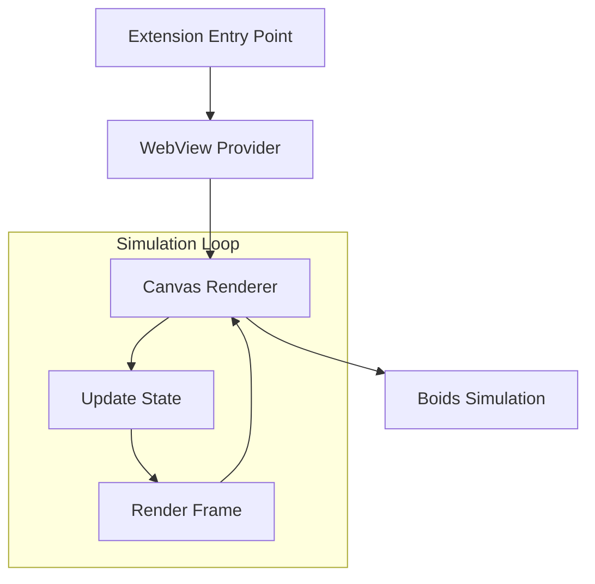

# VSCode Alife - システムパターン

## アーキテクチャ概要



## コアコンポーネント

### 1. WebView Provider パターン

- `WebViewProvider` クラスによる VSCode と WebView 間の橋渡し
- HTML/CSS/JavaScript による UI レンダリング
- スクリプト実行の安全な有効化

```typescript
class WebViewProvider implements vscode.WebviewViewProvider {
  constructor(private extensionUri: vscode.Uri) {}
  public resolveWebviewView(webviewView: vscode.WebviewView) {
    // WebViewの設定と初期化
  }
}
```

### 2. Boid シミュレーションパターン

#### 2.1 Boid の状態管理

```typescript
interface Boid {
  x: number;
  y: number;
  vx: number;
  vy: number;
}
```

#### 2.2 行動ルール

1. **結合（Cohesion）**

   - 群れの中心に向かう傾向
   - 重み付けによる緩やかな移動

2. **分離（Separation）**

   - 他の Boid との衝突回避
   - 距離に基づく反発力の計算

3. **整列（Alignment）**
   - 周囲の Boid の平均速度への適合
   - スムーズな群れの形成

### 3. レンダリングパターン

#### 3.1 ダブルバッファリング

- オフスクリーンキャンバスによる背景描画
- メインキャンバスへの効率的な描画

```typescript
class Renderer {
  private offscreenCanvas: HTMLCanvasElement;
  private mainCanvas: HTMLCanvasElement;

  // 背景の一度だけの描画
  drawBackground() {
    // オフスクリーンキャンバスに描画
  }

  // メインループでの描画
  render() {
    // オフスクリーンキャンバスからメインキャンバスにコピー
    // Boidの描画
  }
}
```

#### 3.2 ピクセルアート最適化

- 事前定義されたピクセルパターン
- 向きに応じた反転処理
- キャッシュを活用した描画

### 4. イベント処理パターン

- クリックイベントによる Boid 追加
- リサイズイベントによるキャンバス調整
- アニメーションフレーム同期

## パフォーマンス最適化

### 1. 計算の最適化

- 距離計算の効率化
- ベクトル演算の簡略化
- 群れサイズの制限（最大 10）

### 2. レンダリングの最適化

- ダブルバッファリングによる背景の再描画削減
- requestAnimationFrame による描画同期
- 必要な部分のみの更新

### 3. メモリ管理

- オブジェクトの再利用
- 適切なデータ構造の選択
- ガベージコレクションの最小化

## エラー処理とセキュリティ

### 1. WebView 制約

- スクリプト実行の制限
- リソースアクセスの制御
- セキュアなコンテンツ配信

### 2. エラー検出と回復

- 境界チェック
- 不正な状態の防止
- グレースフルデグラデーション
